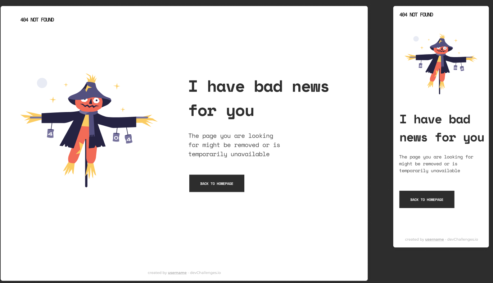
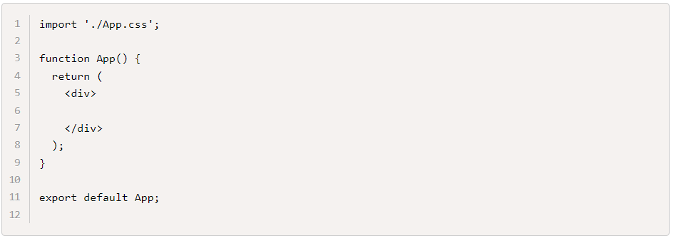

# Intro a JSX
## Reto

El objetivo de esta misión es conocer sobre react y jsx, para ello vamos a utilizar un ejercicio que ya hemos realizado que e el 404 error page

## Tareas

Crear una aplicación de react llamada my-first-react-app usando vite. npm create vite y seleccionar React como framework.
Ir al archivo ./src/App.jsx y borrar todo. Debe quedar de esta forma:

1. En ese archivo vas a pegar el HTML del ejercicio 404 error page que ya resolviste y ajustar el codigo a la sintaxis de JSX.
2. En el archivo ./src/App.css copiar todo el css de tu ejercicio 404 error page
3. Ejecutar en la consola npm run dev y verificar que tu aplicación se ve como debería verse.
4. Subir tu proyecto a un nuevo repositorio de github llamado my-first-react-app y compartir el link de tu repo acá.
